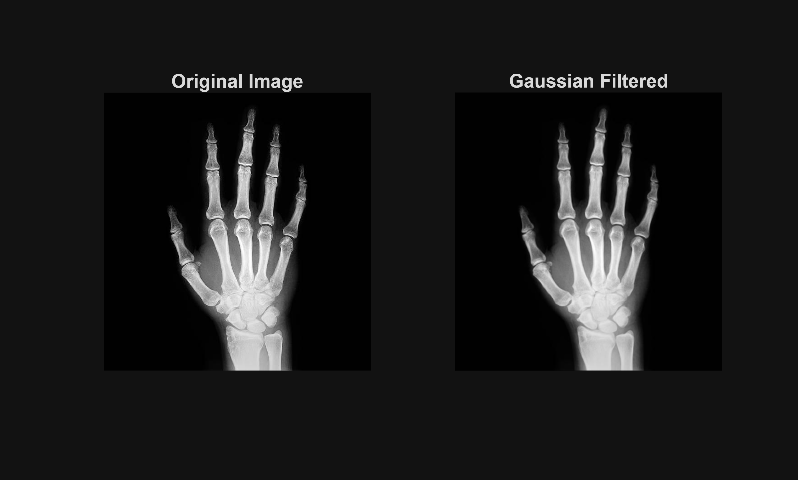
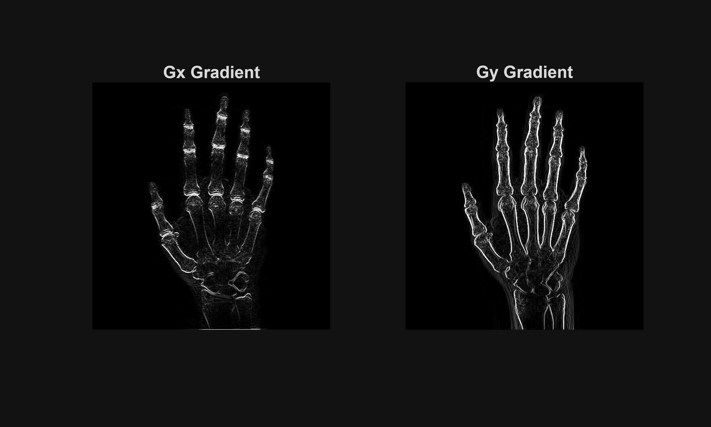
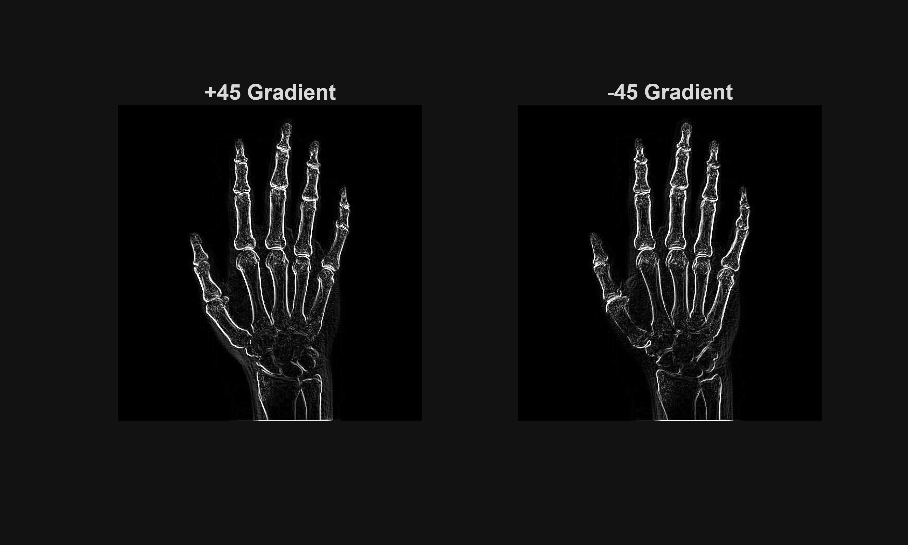
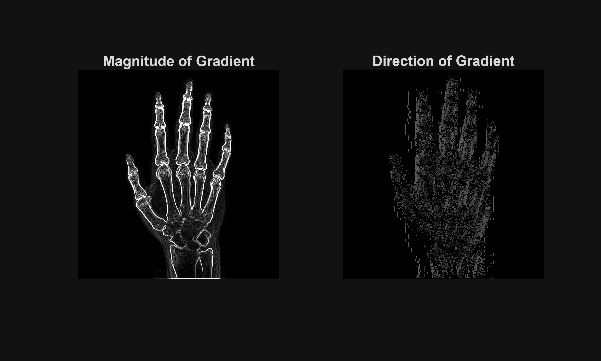
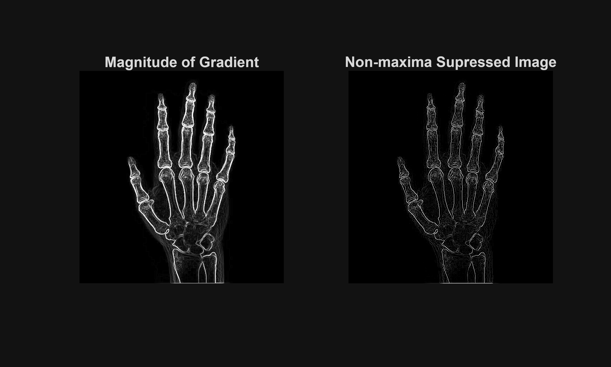
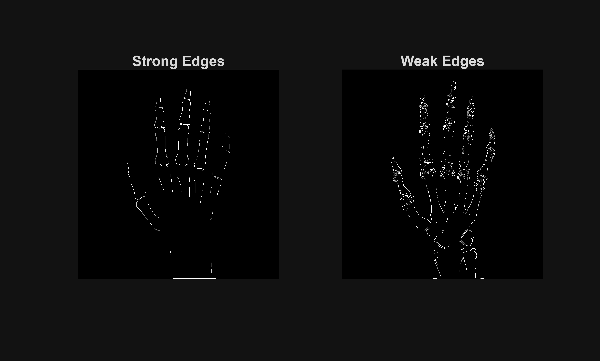
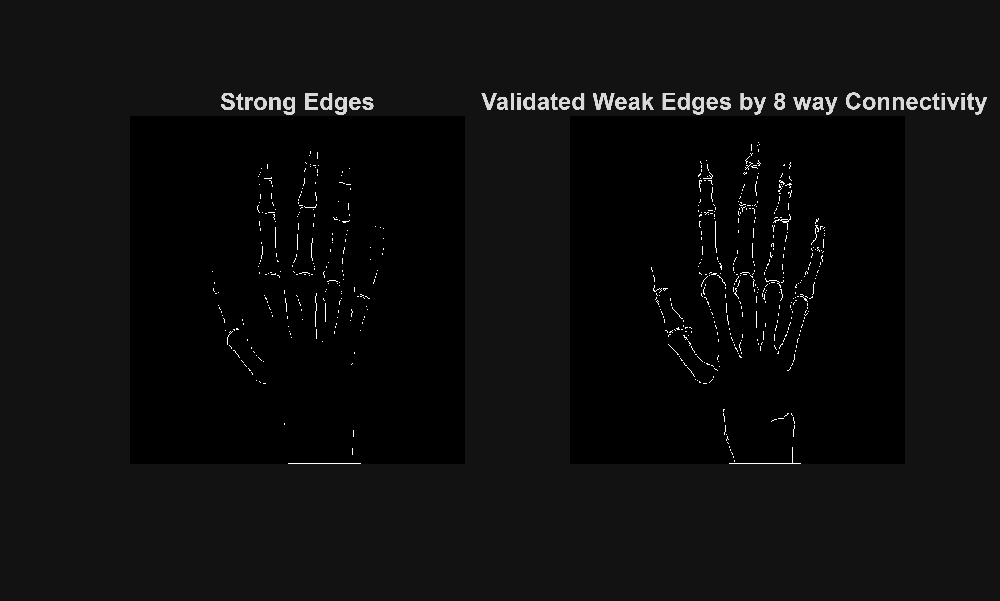
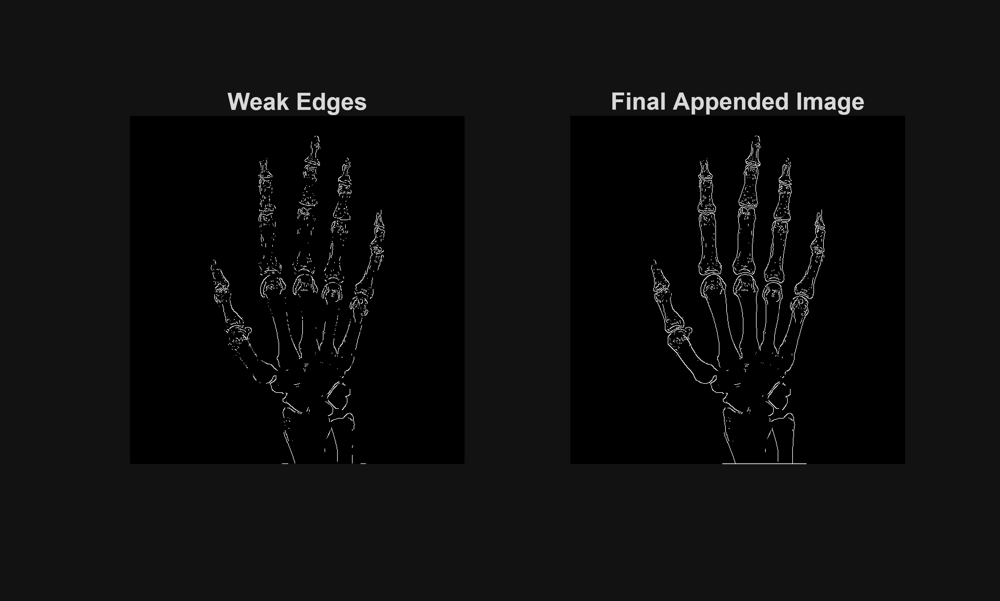

```matlab
clear all; close all;
```

# Preliminaries
```matlab
a=imread('image777.jpg');


d=rgb2gray(a);    % Convert to Gray scale Image


e=double(d);      % CConvert to Double format matrix


R=size(d,1);      % Number of Rows in the Image
C=size(d,2);      % Number of Columns in the Image
l=ones(R,C);      % Unit Matrix equivalent to the dimensions of Input Image
```

# Step 1: Gaussian Smoothing
```matlab
s=1.4142;    % Sigma Value 


% Calculating 3x3 Gaussian Kernel Coefficients
k=zeros(3);
for i=-1:1
    for j=-1:1     
        k(i+2,j+2)=((1/sqrt(2*pi*s^2))*exp(-(i.^2+j.^2)/(2*(s).^2)));
    end
end
k=k./sum(k(:));


l = convolution(k,e,l,R,C);  
```

# Step2: Sobel Edge detectors to Calculate Gradients
```matlab
s1=[-1 -2 -1;0 0 0;1 2 1];      % Gx gradient
s2=[-1 0 1;-2 0 2;-1 0 1];      % Gy gradient
s3=[0 1 2;-1 0 1;-2 -1 0];      % +45 gradient
s4=[-2 -1 0;-1 0 1;0 1 2];      % -45 gradient


l1 = convolution(s1,e,l,R,C);
l2 = convolution(s2,e,l,R,C);
l3 = convolution(s3,e,l,R,C);
l4 = convolution(s4,e,l,R,C);


% Gradient Magnitude Calculation
M=sqrt(l1.^2+l2.^2);


% Gradient direction (angle) Calculation
A=atand(l2./(l1+0.0000001));


GN=zeros(R,C);
```

# Step 3: Nonmaxima Suppression
```matlab
for i=1:R
    for j=1:C
        
        % Top Left Corner point
        if i==1 && j==1
            
            if (A(i,j)> -22.5 && A(i,j) <=22.5) || (A(i,j)> 157.5 || A(i,j) <= -157.5)
             
                if M(i,j)>M(i+1,j) 
                    GN(i,j)=M(i,j);
                else
                    GN(i,j)=0;  
                end
             
           elseif (A(i,j)> 22.5 && A(i,j) <= 67.5) || (A(i,j)> -157.5 && A(i,j)<= -112.5)
            
                if M(i,j)>M(i+1,j+1) 
                    GN(i,j)=M(i,j);
                else
                    GN(i,j)=0;  
                end
               
           elseif (A(i,j)> 67.5 && A(i,j)<= 112.5) ||(A(i,j)> -112.5 && A(i,j) <= -67.5)
                
               if M(i,j)>M(i,j+1) 
                    GN(i,j)=M(i,j);
               else
                    GN(i,j)=0;  
                end
          
           elseif (A(i,j)> 112.5 && A(i,j)<= 157.5) || (A(i,j)> -67.5 && A(i,j) <=-22.5)
               
                 GN(i,j)=M(i,j); 
               
            end
        end   %% End of 1st corner point
        
         % Top Right Corner Point
            
        if  i==1 && j==C
            
             if (A(i,j)> -22.5 && A(i,j) <=22.5) || (A(i,j)> 157.5 || A(i,j) <= -157.5)
             
                if M(i,j)>M(i+1,j) 
                    GN(i,j)=M(i,j);
                else 
                    GN(i,j)=0;  
                end
             
           elseif (A(i,j)> 22.5 && A(i,j) <= 67.5) || (A(i,j)> -157.5 && A(i,j)<= -112.5)
            
               GN(i,j)=M(i,j); 
               
           elseif (A(i,j)> 67.5 && A(i,j)<= 112.5) ||(A(i,j)> -112.5 && A(i,j) <= -67.5)
                
               if M(i,j)>M(i,j-1) 
                    GN(i,j)=M(i,j);
               else
                    GN(i,j)=0;  
                end
          
           elseif (A(i,j)> 112.5 && A(i,j)<= 157.5) || (A(i,j)> -67.5 && A(i,j) <=-22.5)
               
                  if M(i,j)>M(i+1,j-1) 
                    GN(i,j)=M(i,j);
                  else
                    GN(i,j)=0;  
                  end
               
               
            end
          
        end %% End of 2nd corner point
        
        
        % Bottom Left Corner point
        if i==R && j==1
            
            if (A(i,j)> -22.5 && A(i,j) <=22.5) || (A(i,j)> 157.5 || A(i,j) <= -157.5)
             
                if M(i,j)>M(i-1,j) 
                    GN(i,j)=M(i,j);
                else
                    GN(i,j)=0;  
                end
             
           elseif (A(i,j)> 22.5 && A(i,j) <= 67.5) || (A(i,j)> -157.5 && A(i,j)<= -112.5)
            
                GN(i,j)=M(i,j); 
               
           elseif (A(i,j)> 67.5 && A(i,j)<= 112.5) ||(A(i,j)> -112.5 && A(i,j) <= -67.5)
                
               if M(i,j)>M(i,j+1) 
                    GN(i,j)=M(i,j);
               else
                    GN(i,j)=0;  
                end
          
           elseif (A(i,j)> 112.5 && A(i,j)<= 157.5) || (A(i,j)> -67.5 && A(i,j) <=-22.5)
               
                if M(i,j)>M(i-1,j+1) 
                    GN(i,j)=M(i,j);
                else
                    GN(i,j)=0;  
                end
        
            end
            
        end % End of 3rd corner point
        
         % Bottom Right Corner point
         
         if i==R && j==C
             
           if (A(i,j)> -22.5 && A(i,j) <=22.5) || (A(i,j)> 157.5 || A(i,j) <= -157.5)
             
                if M(i,j)>M(i-1,j) 
                    GN(i,j)=M(i,j);
                else
                    GN(i,j)=0;  
                end
             
           elseif (A(i,j)> 22.5 && A(i,j) <= 67.5) || (A(i,j)> -157.5 && A(i,j)<= -112.5)
            
                if M(i,j)>M(i-1,j-1) 
                    GN(i,j)=M(i,j);
                else
                    GN(i,j)=0;  
                end
              
               
           elseif (A(i,j)> 67.5 && A(i,j)<= 112.5) ||(A(i,j)> -112.5 && A(i,j) <= -67.5)
                
               if M(i,j)>M(i,j-1) 
                    GN(i,j)=M(i,j);
               else
                    GN(i,j)=0;  
                end
          
           elseif (A(i,j)> 112.5 && A(i,j)<= 157.5) || (A(i,j)> -67.5 && A(i,j) <=-22.5)
               
               GN(i,j)=M(i,j); 
               
           end
             
         end % End of 4th corner point
        
        % Top Border
        if i==1 && (j>=2 && j<=C-1)
            
            if (A(i,j)> -22.5 && A(i,j) <=22.5) || (A(i,j)> 157.5 || A(i,j) <= -157.5)
             
                if M(i,j)>M(i+1,j) 
                    GN(i,j)=M(i,j);
                else
                    GN(i,j)=0;  
                end
             
           elseif (A(i,j)> 22.5 && A(i,j) <= 67.5) || (A(i,j)> -157.5 && A(i,j)<= -112.5)
            
                if M(i,j)>M(i+1,j+1) 
                    GN(i,j)=M(i,j);
                else
                    GN(i,j)=0;  
                end
              
               
           elseif (A(i,j)> 67.5 && A(i,j)<= 112.5) ||(A(i,j)> -112.5 && A(i,j) <= -67.5)
                
               if M(i,j)>M(i,j-1) &&  M(i,j)>M(i,j+1)
                    GN(i,j)=M(i,j);
               else
                    GN(i,j)=0;  
               end
          
           elseif (A(i,j)> 112.5 && A(i,j)<= 157.5) || (A(i,j)> -67.5 && A(i,j) <=-22.5)
               
               if M(i,j)>M(i+1,j-1) 
                    GN(i,j)=M(i,j);
               else
                    GN(i,j)=0;  
               end
               
            end
            
           
        end % End of Top Border
        
        % Bottom Border
        
        if i==R && (j>=2 && j<=C-1)
            
            if (A(i,j)> -22.5 && A(i,j) <=22.5) || (A(i,j)> 157.5 || A(i,j) <= -157.5)
             
                if M(i,j)>M(i-1,j) 
                    GN(i,j)=M(i,j);
                else
                    GN(i,j)=0;  
                end
             
           elseif (A(i,j)> 22.5 && A(i,j) <= 67.5) || (A(i,j)> -157.5 && A(i,j)<= -112.5)
            
                if M(i,j)>M(i-1,j-1) 
                    GN(i,j)=M(i,j);
                else
                    GN(i,j)=0;  
                end
              
               
           elseif (A(i,j)> 67.5 && A(i,j)<= 112.5) ||(A(i,j)> -112.5 && A(i,j) <= -67.5)
                
               if M(i,j)>M(i,j-1) &&  M(i,j)>M(i,j+1)
                    GN(i,j)=M(i,j);
               else
                    GN(i,j)=0;  
               end
          
           elseif (A(i,j)> 112.5 && A(i,j)<= 157.5) || (A(i,j)> -67.5 && A(i,j) <=-22.5)
               
               if M(i,j)>M(i-1,j+1) 
                    GN(i,j)=M(i,j);
               else
                    GN(i,j)=0;  
               end
               
            end
               
        end % End of the Bottom Border
        
        % Left Border
        if (i>=2 && i<=R-1) && j==1
            
             if (A(i,j)> -22.5 && A(i,j) <=22.5) || (A(i,j)> 157.5 || A(i,j) <= -157.5)
             
                if M(i,j)>M(i-1,j) && M(i,j)>M(i+1,j)
                    GN(i,j)=M(i,j);
                else
                    GN(i,j)=0;  
                end
             
           elseif (A(i,j)> 22.5 && A(i,j) <= 67.5) || (A(i,j)> -157.5 && A(i,j)<= -112.5)
            
                if M(i,j)>M(i+1,j+1) 
                    GN(i,j)=M(i,j);
                else
                    GN(i,j)=0;  
                end
              
               
           elseif (A(i,j)> 67.5 && A(i,j)<= 112.5) ||(A(i,j)> -112.5 && A(i,j) <= -67.5)
                
               if M(i,j)>M(i,j+1) 
                    GN(i,j)=M(i,j);
               else
                    GN(i,j)=0;  
               end
          
           elseif (A(i,j)> 112.5 && A(i,j)<= 157.5) || (A(i,j)> -67.5 && A(i,j) <=-22.5)
               
               if M(i,j)>M(i-1,j+1) 
                    GN(i,j)=M(i,j);
               else
                    GN(i,j)=0;  
               end
               
            end
            
        end % End of the Left Border
        
        % Right Border
        if (i>=2 && i<=R-1) && j==C
            
             if (A(i,j)> -22.5 && A(i,j) <=22.5) || (A(i,j)> 157.5 || A(i,j) <= -157.5)
             
                if M(i,j)>M(i-1,j) && M(i,j)>M(i+1,j)
                    GN(i,j)=M(i,j);
                else
                    GN(i,j)=0;  
                end
             
           elseif (A(i,j)> 22.5 && A(i,j) <= 67.5) || (A(i,j)> -157.5 && A(i,j)<= -112.5)
            
                if M(i,j)>M(i-1,j-1) 
                    GN(i,j)=M(i,j);
                else
                    GN(i,j)=0;  
                end
              
               
           elseif (A(i,j)> 67.5 && A(i,j)<= 112.5) ||(A(i,j)> -112.5 && A(i,j) <= -67.5)
                
               if M(i,j)>M(i,j-1) 
                    GN(i,j)=M(i,j);
               else
                    GN(i,j)=0;  
               end
          
           elseif (A(i,j)> 112.5 && A(i,j)<= 157.5) || (A(i,j)> -67.5 && A(i,j) <=-22.5)
               
               if M(i,j)>M(i+1,j-1) 
                    GN(i,j)=M(i,j);
               else
                    GN(i,j)=0;  
               end
               
             end 
            
        end % End of the Right Border
        
        % Middle Section
        if (i>=2&&i<=R-1) && (j>=2&&j<=C-1)
            
             if (A(i,j)> -22.5 && A(i,j) <=22.5) || (A(i,j)> 157.5 || A(i,j) <= -157.5)
             
                if M(i,j)>M(i-1,j) && M(i,j)>M(i+1,j)
                    GN(i,j)=M(i,j);
                else
                    GN(i,j)=0;  
                end
             
           elseif (A(i,j)> 22.5 && A(i,j) <= 67.5) || (A(i,j)> -157.5 && A(i,j)<= -112.5)
            
                if M(i,j)>M(i-1,j-1) && M(i,j)>M(i+1,j+1) 
                    GN(i,j)=M(i,j);
                else
                    GN(i,j)=0;  
                end
              
               
           elseif (A(i,j)> 67.5 && A(i,j)<= 112.5) ||(A(i,j)> -112.5 && A(i,j) <= -67.5)
                
               if M(i,j)>M(i,j-1) && M(i,j)>M(i,j+1)
                    GN(i,j)=M(i,j);
               else
                    GN(i,j)=0;  
               end
          
           elseif (A(i,j)> 112.5 && A(i,j)<= 157.5) || (A(i,j)> -67.5 && A(i,j) <=-22.5)
               
               if M(i,j)>M(i+1,j-1) && M(i,j)>M(i-1,j+1) 
                    GN(i,j)=M(i,j);
               else
                    GN(i,j)=0;  
               end
               
             end 
            
            
        end % End of the Middle section
        
        
    end
end
```

# STep 4: Double Thresholding Process
```matlab
GhN=GN>=400;   % High Threshold  for Strong Edges 


GlN=GN>=140;   % Low Threshold  for Strong + Weak Edges  


GlN=logical(GlN-GhN);   % for Weak Edegs 
```

# Step 5: 8 way Connectivity
```matlab
GG1=logical(connect8(GlN,GhN,R,C));    % unvisited pixels in Strong Edges


GG2=logical(connect8(GhN,GlN,R,C));    % unvisited pixels in Weak Edges


GG1=logical(GG1+GhN);    % Reassigned valid pixels with strong Edges
GG2=logical(GG2+GhN);    % Reassigned valid pixels with strong Edges


for q=1:500
GGtemp=logical(connect8(GlN,GG1,R,C));    % unvisited pixels in Strong Edges
GG1=logical(GG1+GGtemp);
end
```

# Resulting Figures
```matlab
figure;
subplot(1,2,1);imshow(d) ;title('Original Image','Fontsize',10);
subplot(1,2,2);imshow(uint8(l));title('Gaussian Filtered','Fontsize',10);
```



```matlab


figure('Name','Sobel Edge Detection'); 
subplot(1,2,1);imshow(uint8(abs(l1)));title('Gx Gradient','Fontsize',10);
subplot(1,2,2);imshow(uint8(abs(l2)));title('Gy Gradient','Fontsize',10);
```



```matlab


figure('Name','Sobel Edge Detection'); 
subplot(1,2,1);imshow(uint8(abs(l3)));title('+45 Gradient','Fontsize',10);
subplot(1,2,2);imshow(uint8(abs(l4)));title('-45 Gradient','Fontsize',10);
```



```matlab


figure('Name','Magnitude of Gradient and Direction of Gradient');
subplot(1,2,1);imshow(uint8(M));title('Magnitude of Gradient','Fontsize',10);
subplot(1,2,2);imshow(uint8(A));title('Direction of Gradient','Fontsize',10);
```



```matlab


figure('Name','Non-maxima Supression');
subplot(1,2,1);imshow(uint8(M));title('Magnitude of Gradient','Fontsize',10);
subplot(1,2,2);imshow(uint8(GN));title('Non-maxima Supressed Image','Fontsize',10); % NonMaxima Suppressed Image
```



```matlab


 
figure('Name','Strong Edges and Weak Edges');
subplot(1,2,1);imshow((GhN));title('Strong Edges','Fontsize',10);
subplot(1,2,2);imshow((GlN));title('Weak Edges','Fontsize',10);
```



```matlab


figure('Name','Edge Validation');
subplot(1,2,1);imshow((GhN));title('Strong Edges','Fontsize',10);
subplot(1,2,2);imshow(GG1);title('Validated Weak Edges by 8 way Connectivity ','Fontsize',10);
```



```matlab


figure('Name','Final Outcome');
subplot(1,2,1);imshow((GlN));title('Weak Edges','Fontsize',10);
subplot(1,2,2);imshow(GG1+GlN);title('Final Appended Image','Fontsize',10);
```



# Convolution Function
```matlab
function l = convolution(c,e,l,R,C)


for i=1:R
    for j=1:C
        
        if i==1 && j==1
            l(i,j)=(c(2,2)*e(i,j)+c(2,3)*e(i,j+1)+c(3,2)*e(i+1,j)+c(3,3)*e(i+1,j+1));
        end
        
        if i==1 && j==C
            l(i,j)=(c(2,2)*e(i,j)+c(2,1)*e(i,j-1)+c(3,1)*e(i+1,j-1)+c(3,2)*e(i+1,j));
        end
        
        if i==R && j==1
            l(i,j)=(c(2,2)*e(i,j)+c(2,3)*e(i,j+1)+c(1,2)*e(i-1,j)+c(1,3)*e(i-1,j+1));
        end
        
        if i==R && j==C
            l(i,j)=(c(2,2)*e(i,j)+c(2,1)*e(i,j-1)+c(1,1)*e(i-1,j-1)+c(1,2)*e(i-1,j));
        end
         
        if i==1 && j>=2&&j<=C-1
            l(i,j)=(c(2,2)*e(i,j)+c(2,1)*e(i,j-1)+c(2,3)*e(i,j+1)+c(3,2)*e(i+1,j)+c(3,1)*e(i+1,j-1)+c(3,3)*e(i+1,j+1));
        end


        if i==R && j>=2&&j<=C-1
            l(i,j)=(c(2,2)*e(i,j)+c(2,1)*e(i,j-1)+c(2,3)*e(i,j+1)+c(1,2)*e(i-1,j)+c(1,1)*e(i-1,j-1)+c(1,3)*e(i-1,j+1));
        end


        if i>=2 && i<=R-1 && j==1
            l(i,j)=(c(2,2)*e(i,j)+c(1,2)*e(i-1,j)+c(3,2)*e(i+1,j)+c(2,3)*e(i,j+1)+c(1,3)*e(i-1,j+1)+c(3,3)*e(i+1,j+1));
        end


        if i>=2 && i<=R-1 && j==C
            l(i,j)=(c(2,2)*e(i,j)+c(1,2)*e(i-1,j)+c(3,2)*e(i+1,j)+c(2,1)*e(i,j-1)+c(1,1)*e(i-1,j-1)+c(3,1)*e(i+1,j-1));
        end 


        if i>=2&&i<=R-1&&j>=2&&j<=C-1
            l(i,j)=(c(2,2)*e(i,j)+c(2,1)*e(i,j-1)+c(2,3)*e(i,j+1)+c(1,1)*e(i-1,j-1)+c(1,2)*e(i-1,j)+c(1,3)*e(i-1,j+1)+c(3,1)*e(i+1,j-1)+c(3,2)*e(i+1,j)+c(3,3)*e(i+1,j+1));
        end
        
    end  
end


end
```

# 8 way connectivity function
```matlab
function GG=connect8(GlN,GhN,R,C)


GG=zeros(R,C);
for i=1:R
    for j=1:C
        
        % Mid Section
        if (i>=2&&i<=R-1) && (j>=2&&j<=C-1)
            
            if GlN(i,j)==1
                
                if (GhN(i-1,j)==1 || GhN(i+1,j)==1) || (GhN(i,j-1)==1 || GhN(i,j+1)==1)
                     GG(i,j)=1;
                elseif (GhN(i-1,j-1)==1 || GhN(i+1,j+1)==1) || (GhN(i+1,j-1)==1 || GhN(i-1,j+1)==1)
                     GG(i,j)=1;
                end
            
            else
                GG(i,j)=0;
            end
        end
        
        
    end
end


end
```